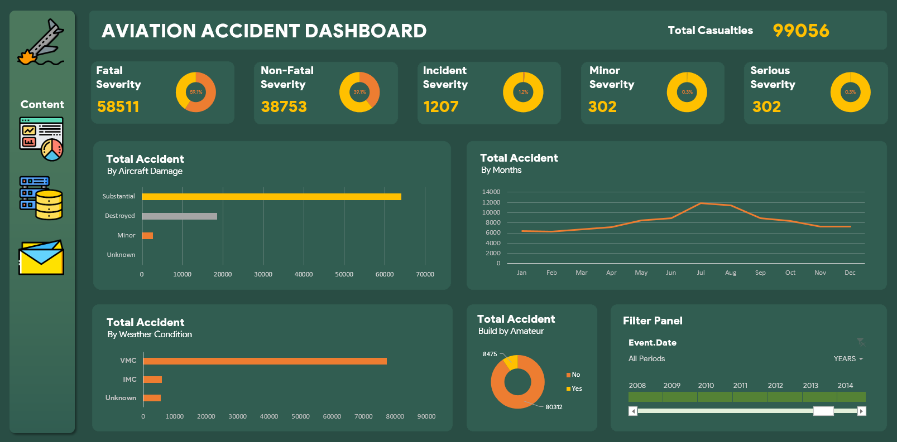

# Aviation Accident Data Visualization Dashboard

The Aviation Accident Data Visualization Dashboard is an excel project designed to make an exploratory data analysis on historical aviation accident data, and make insightful visualization based on data.

## Data Source
The data used for this project was sourced from Kaggle : [Aviation Accident Database](https://www.kaggle.com/datasets/khsamaha/aviation-accident-database-synopses)

The aviation accident database contains information from 1962 and later about civil aviation accidents and selected incidents within the United States, its territories and possessions, and in international waters.

## Dashboard Features

The Dashboard provide a set of key features to facilitate exploration and understanding of aviation accident data:

- Interactive Filters : Users can apply filter based on accident year to refine the visualization displayed on dashboard
- Overview Visualization : The dashboard includes high-level visualizations, such as charts and graphs, to provide an overview of accident trends, distribution, and severity. These visualizations allow users to grasp the big picture and identify patterns or anomalies in the data.
## Usage

To view and use the Aviation Accident Data Visualization Dashboard, follow this step:
- Open the excel file containing the Dashboard
- Open the dashboard sheets on the excel file
- Interact with the dashboard filters to refine the data displayed
- Explore various visualization available to gain insight into different aspect of aviation accidents.
## Example

The above screenshot showcases a view of the Aviation Accident Data Visualization Dashboard.